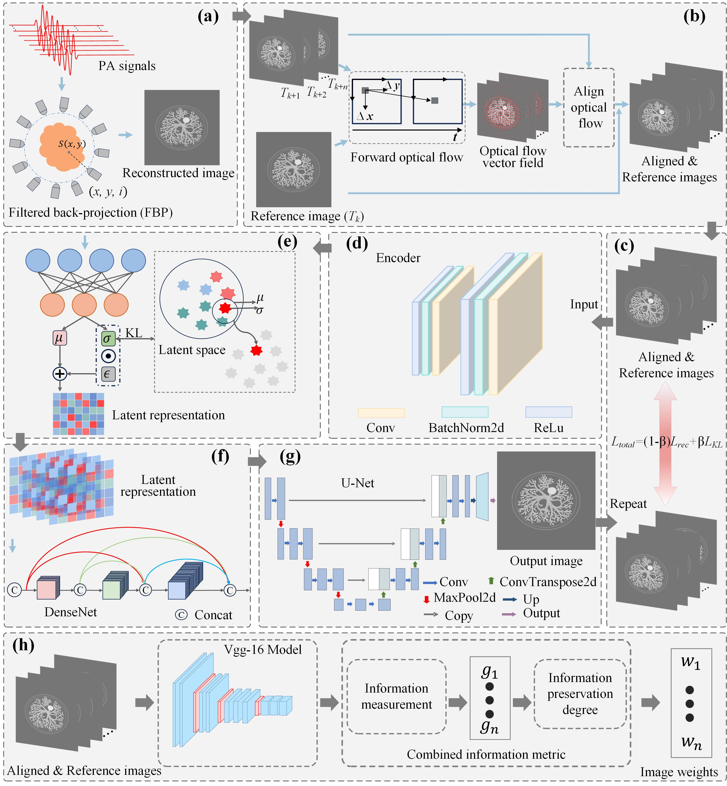
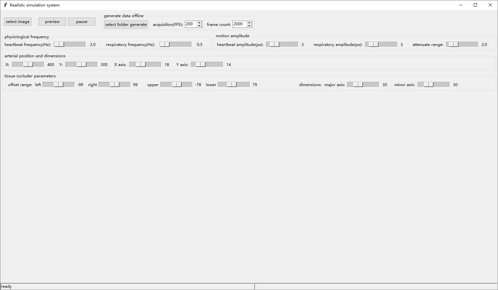
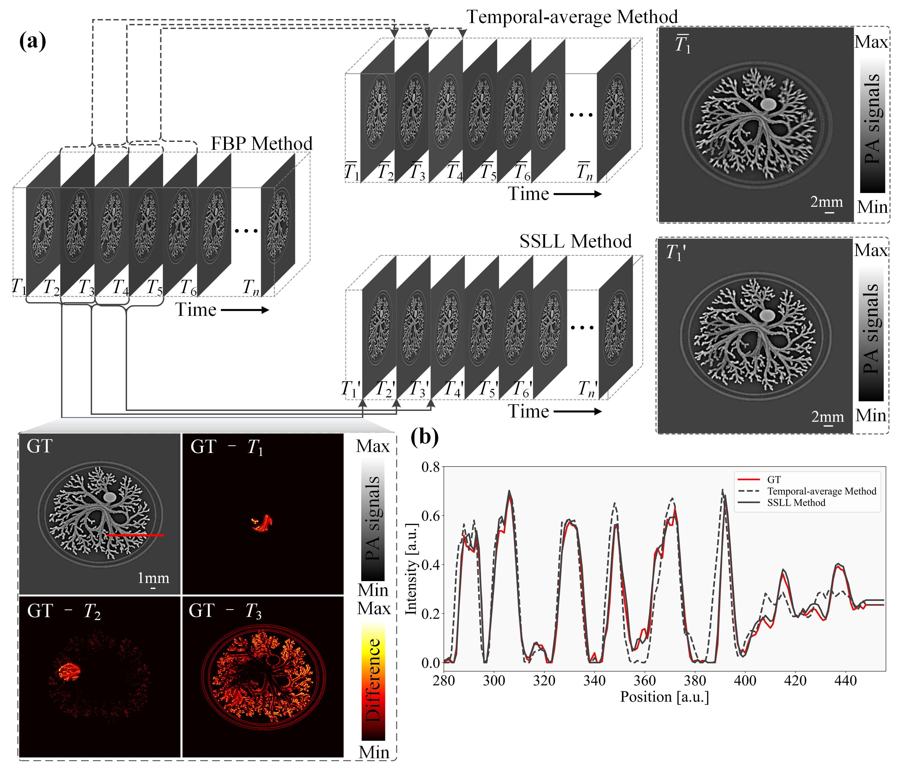

# Self-supervised Latent-space Learning enables Non-averaged High-SNR Dynamic Photoacoustic Computed Tomography

This study introduces Self-Supervised Latent Learning (SSLL) for dynamic photoacoustic computed tomography (PACT), integrating optical-flow-based motion registration with self-supervised latent representation learning to jointly address the long-standing challenges of physiological motion and low signal-to-noise ratio constraints. SSLL can be trained directly on acquired image sequences without external pretraining, and its effectiveness is validated using a physiological-motion benchmark and multi-organ dynamic imaging experiments. 

## Method



**Schematic of the proposed self-supervised latent-space learning framework for dynamic PACT. a,** Photoacoustic image reconstruction maps the acoustic signals received by each transducer element to spatial locations, yielding an initial time-series image sequence. **b,** Optical flow estimates pixel-wise displacement fields between each reference frame and its neighboring frames, enabling non-rigid motion compensation and cross-frame alignment. **c,** The self-supervised reconstruction loss combines structural similarity index measure (SSIM) and mean squared error (MSE) terms to constrain structural consistency and pixel-wise fidelity. **d,** A encoder extracts hierarchical multi-scale features from the reference frame and motion-compensated neighboring frames. **e,** A variational autoencoder projects the encoded features into a compact probabilistic latent space to capture temporally shared structural representations. **f,** DenseNet-based latent fusion aggregates complementary multi-frame latent features into a unified representation. **g,** A U-Net decoder progressively upsamples the fused latent features and restores spatial details to reconstruct the final dynamic PACT image. **h,** VGG-16-derived perceptual features and gradient responses are used to estimate frame-specific adaptive weights, which modulate multi-frame fusion and guide self-supervised optimization. KL, Kullback-Leibler.

## Realistic simulation system

The physiologically realistic motion simulation software adopted in this paper can directly run the file **PhysiologicallyRealisticSimulation.py** and provide [image of physiological tissues](./figure/sample_tissue.png). The effects of the software are shown as follows:



## Physiologically realistic simulation data

The provided data are physiologically realistic simulation data for simulation experiments. [data/](./data)



Comparison of filtered back-projection (FBP), temporal averaging, and SSLL on the physiologically realistic simulated dataset.

## Repository Structure

```
├─opticalFlowAlignment.py
├─reconstruct.py
├─train.py
├─utils
|   └-dataio.py
├─result_new
├─recon
|   └-fbp.py
├─models
|   ├─convEncoderAndVAE.py
|   ├─denseLatentSpace.py
|   ├─ssll.py
|   ├─unetDecoder.py
|   └-unet_parts.py
├─losses
|   ├─kl_loss.py
|   ├─ssim_loss.py
|   └-vgg16.py
├─data
├─config
|   └-recon_parameter.yml
```

## Installation

```
git clone --recursive https://github.com/XiaoYuan-Camellia/SSLL-PACT.git
cd SSLL-PACT

# create conda environment
conda create -n SSLL_PACT python=3.8 -y
conda activate SSLL_PACT
conda install pytorch torchvision torchaudio pytorch-cuda=11.6 -c pytorch -c nvidia

# install other packages
pip install -r requirements.txt
```

## Usage

Reconstruction of the radio-frequency (RF) data using the filtered back projection method.

```
python reconstruct.py 
--config ./config/recon_parameter.yml 
--singoram ./data/05Hz_03Hz_L_30_S_25_blocked_sim_1_to_120.mat 
-o ./result_new/05Hz_03Hz_L_30_S_25_blocked_sim_1_to_120/fbp
```

The following code was used to perform optical-flow-based image registration.

```
python opticalFlowAlignment.py 
--input_folder ./result_new/05Hz_03Hz_L_30_S_25_blocked_sim_1_to_120/fbp/images 
--output_folder ./result_new/05Hz_03Hz_L_30_S_25_blocked_sim_1_to_120/align_img
```

Run the following command to reconstruct a high-SNR PACT  image by fusing the motion-compensated images using SSLL method.

```
python train.py 
--num_eopchs 6000 
--beta 0.7 
--lr 1e-3 
--root_path ./result_new/05Hz_03Hz_L_30_S_25_blocked_sim_1_to_120/align_img
```

## Citation

